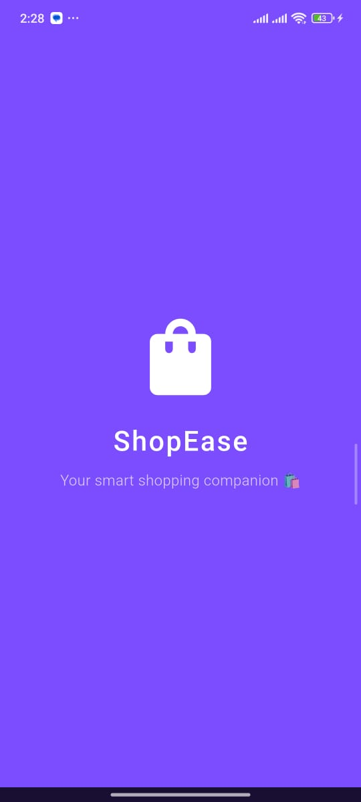
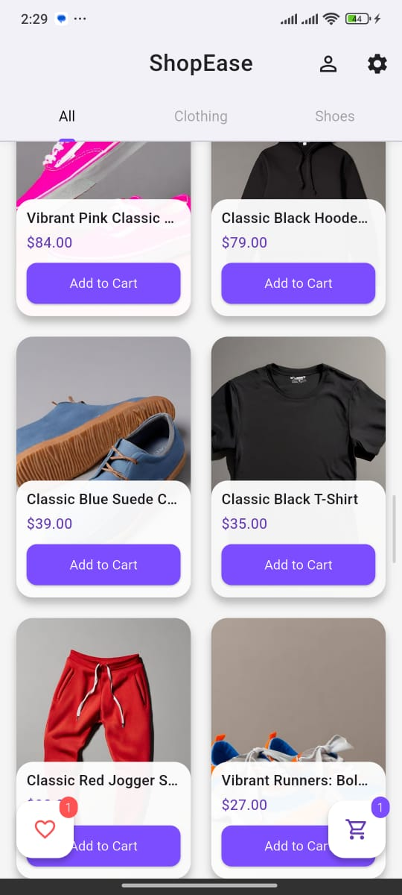
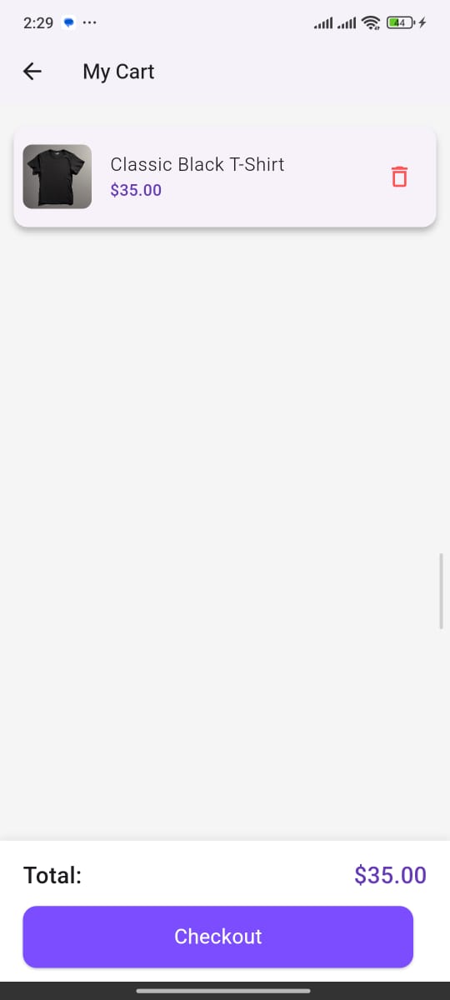
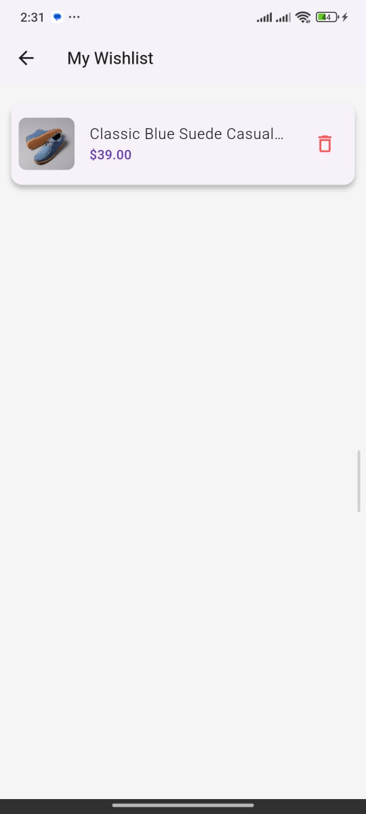
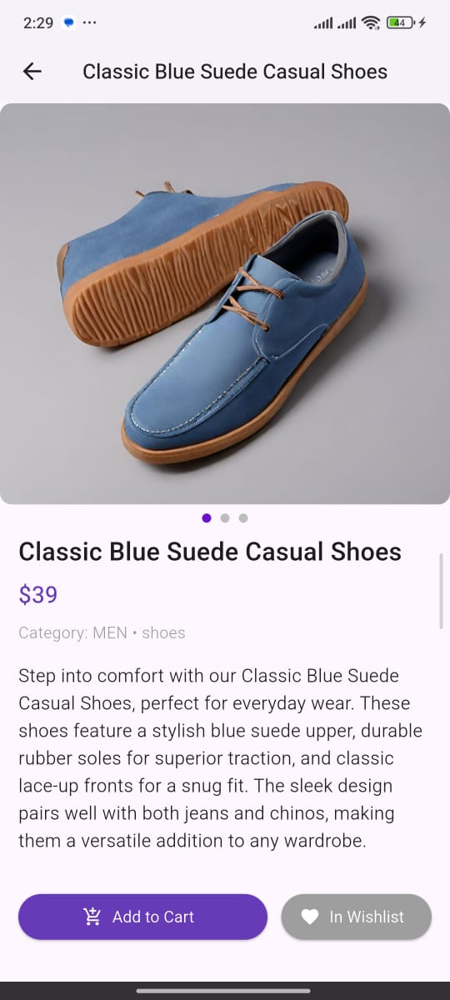

# 🛍️ Flutter E-Commerce Demo App

A modern Flutter e-commerce app built with Firebase — featuring authentication, product management, wishlist, cart, order tracking, and offline support.

---

## ✨ Features
- 🔐 Firebase Authentication (Login / Logout)
- 🛒 Shopping Cart with persistent storage (SharedPreferences)
- ❤️ Wishlist saved offline
- 🧾 Order History (Local Storage)
- 🌐 Real-time Product Sync with Firestore
- 📦 Smooth Checkout Flow
- 🌙 Material 3 UI + Responsive Layout
- ⚡ Splash Screen + Firebase Initialization

---

## 🧠 Tech Stack
- **Framework:** Flutter (Dart)
- **Backend:** Firebase Firestore + Auth
- **State Management:** Provider
- **Local Storage:** SharedPreferences
- **Animations:** Flutter built-in transitions

---

## 📸 Screenshots
| Splash                       | Home                       | Cart                       | Wishlist                       | Product details                       |
|------------------------------|----------------------------|----------------------------|--------------------------------|---------------------------------------|
|  |  |  |  |  |

---

## 🛠️ Setup Instructions
```bash
# 1️⃣ Clone the repository
git clone https://github.com/yourname/flutter_ecommerce_demo.git

# 2️⃣ Get dependencies
flutter pub get

# 3️⃣ Add Firebase config files
# - android/app/google-services.json
# - ios/Runner/GoogleService-Info.plist

# 4️⃣ Run the app
flutter run

# (A few resources to get you started if this is your first Flutter project:)

# ()
# (- [Lab: Write your first Flutter app]&#40;https://docs.flutter.dev/get-started/codelab&#41;)

# (- [Cookbook: Useful Flutter samples]&#40;https://docs.flutter.dev/cookbook&#41;)

# ()
# (For help getting started with Flutter development, view the)

# ([online documentation]&#40;https://docs.flutter.dev/&#41;, which offers tutorials,)

# (samples, guidance on mobile development, and a full API reference.)
